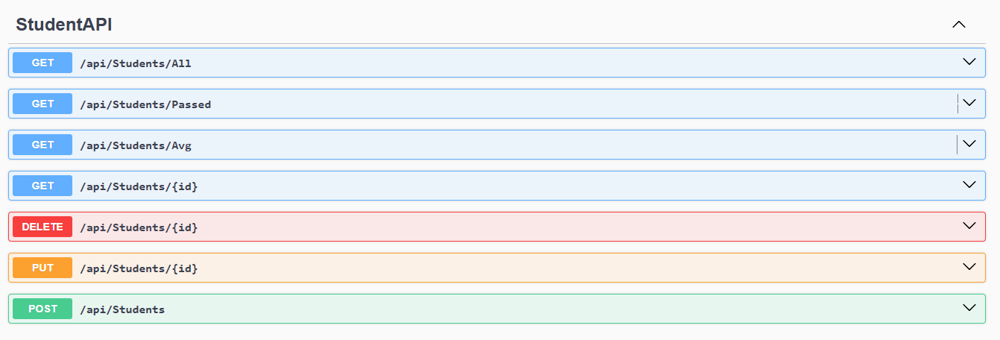
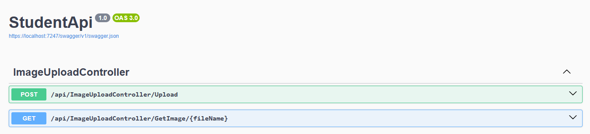

# StudentAPI
## Overview
StudentAPI is a backend project built with ASP.NET Core and ADO.NET. It demonstrates RESTful CRUD operations and direct SQL Server integration without using an ORM.

## Features
- RESTful API with CRUD operations
- ADO.NET for manual database access
- Layered architecture (Business, Data Access, API, Client)
- Swagger for endpoint testing

## Technologies Used
- ASP.NET Core
- ADO.NET
- SQL Server
- Swagger

## API Preview

Here’s a look at the StudentAPI endpoints via Swagger UI:

### Student Endpoints

### Image Upload Endpoints

## Learning Source
This project was built as part of the **Intro to REST API** course by [Mohamed Abu-Hadhoud] on the **Programming Advices** platform.  
It was my first backend API project, and it helped me understand RESTful architecture, layered design, and ADO.NET for database integration.

Special thanks to the instructor for his clear explanations and practical approach.

